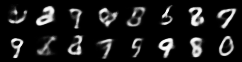

# Variational Auto Encoder to Create Synthetic Retina Fundus images

The goal of this project is to create synthetic data for models that will be trained on retina fundus images to detect diabetic retinopathy.

The first step is to create a Variational Auto Encoder (VAE) and test it with a dataset that is available in pytorch.

This is setting up determinism according to the PyTorch docs and initially following the turorial of Aladdin Persson: https://www.youtube.com/watch?v=VELQT1-hILo&t=1618s

## Setup

### 1. System level:
These commands are designed for the supercomputer (HPC) environment:

- **`module load`** - Loads pre-installed software packages from the system's module system. This is common on HPC clusters where different software versions are managed centrally.

- **`cuda/12.2.1-gcc-13.2.0`** - Loads NVIDIA's CUDA toolkit for GPU acceleration. PyTorch can use this for faster training on GPUs.

```bash
module load cuda/12.2.1-gcc-13.2.0
```
**Note:** If you have a GPU in a linux machine, instructions are below.


### 2. Python packages:

- **`uv sync`** - [uv](https://github.com/astral-sh/uv) is a fast Python package manager (used everywhere in this project). `uv sync` synchronizes the virtual environment with `pyproject.toml` dependencies (creates `.venv` if it doesn't exist).

- **`source .venv/bin/activate`** - Activates the virtual environment so you use the installed packages instead of system Python.
```bash
uv sync
source .venv/bin/activate
```

### Local Linux (with NVIDIA GPU, replaces system level step 1 above)

If you're running on a local Linux machine with an NVIDIA GPU:

1. **Install NVIDIA drivers** - Most Linux distributions have this in their package manager (e.g., `apt install nvidia-driver-535` on Ubuntu)

2. **Install CUDA Toolkit** - Download from [NVIDIA's website](https://developer.nvidia.com/cuda-downloads) or use your package manager

3. **Install cuDNN** - Download from [NVIDIA's website](https://developer.nvidia.com/cudnn) (requires account, but free). Extract to your CUDA installation directory.

4. **Verify GPU access:**
   ```bash
   nvidia-smi  # Should show your GPU
   ```
**Note:** If you don't have a GPU or CUDA installed, PyTorch will automatically fall back to CPU (slower training).

## Usage

### Training

Train the model with default settings (MNIST, 10 epochs):

```bash
python train.py
```

This will:
- Train a VAE on MNIST training set
- Evaluate on MNIST test set
- Save the model to `vae_mnist.pth`
- Print the test loss to the console
- Generate sample images to `generated.png`

### Custom Training

You can customize training parameters:

```python
from train import train

model = train(
    input_dim=784,      # 28x28 = 784
    hidden_dim=200,
    z_dim=20,
    epochs=10,
    batch_size=32,
    lr=3e-4,
    save_path="vae_mnist.pth"
)
```

### Generating Images

Generate new images using a trained model:

```python
from train import generate

# Generate from a trained model
generate(model, num_samples=16, save_path="generated.png")

# Or load from saved weights and generate
generate(num_samples=16, save_path="generated.png")
```

An output could look like the following example:



### Compare weights

Check with the compare.py script if two PyTorch model weights files are the same:

```bash
python compare.py
```

Example weights of training the model with the default values are provided in the root of the repository under `vae_mnist.pth`.

### Load Datasets

Load and inspect numpy datasets (.npz format):

```bash
load-dataset path/to/dataset.npz --train    # Load training split (default)
load-dataset path/to/dataset.npz --test     # Load test split
```

This CLI is installed via `pyproject.toml` and requires `uv sync` to register.
